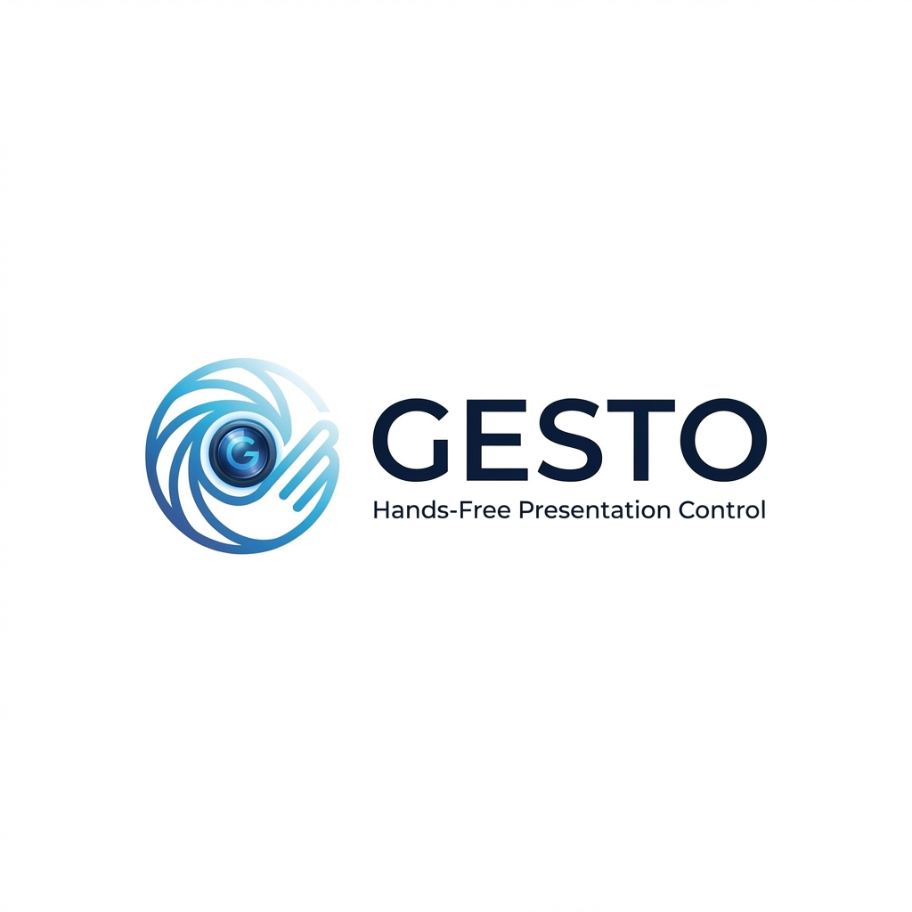

<div align="center">
  
</div>

# Gesto

웹캠과 제스처만으로 PPT와 유투브를 제어하는 도구.

## 1. 프로젝트 개요

- **기술 스택** : Mediapipe, LSTM, PyAutoGui, PyQT6
- **타겟 유저** : 리모컨을 잃어버린 발표자, 귀차니즘이 많은 영화광

## 2. 기능

| 카테고리 | 기능 | 제스처 |
|---------|------|--------|
| 공통필수기능 | 동작 감지 시작 | |
| 공통필수기능 | 동작 감지 종료 | |
| PPT 전용 | 다음 슬라이드 | |
| PPT 전용 | 이전 슬라이드 | |
| PPT 전용 | 슬라이드 쇼 시작 | |
| 유투브 모드 | 재생 | |
| 유투브 모드 | 일시정지 | |
| 유투브 모드 | 볼륨업 | |
| 유투브 모드 | 볼륨다운 | |
| 유투브 모드 | 음소거 | |
| 유투브 모드 | 전체화면 | | 

## 설정

```bash
# conda 로 gesto 가상환경 만들기
conda create -n gesto python=3.10
conda activate gesto

pip install -r requirements.txt
```

## Semantic commit message

커밋 메시지는 다음 접두사를 사용해야 합니다:
- `feat`: 새로운 기능 추가
- `fix`: 버그 수정
- `chore`: 빌드 업무 수정, 패키지 매니저 설정 등
- `refactor`: 코드 리팩토링

예시:
```
feat: add gesture recognition
fix: camera connection error
chore: requirements.txt update
refactor: improve UI component structure
```

## 프로젝트 구조

```
src/
├── gesture/                    # 제스처 인식 모듈
│   ├── base/                   # 기본 클래스
│   │   ├── gesture_base.py      # BaseGesture 추상 클래스
│   │   ├── static_gesture.py    # StaticGesture 추상 클래스
│   │   └── dynamic_gesture.py   # DynamicGesture 추상 클래스
│   ├── common/                  # COMMON 모드 제스처
│   │   ├── start_gesture.py     # START 제스처 (정적)
│   │   └── stop_gesture.py      # STOP 제스처 (동적)
│   ├── ppt/                     # PPT 모드 제스처
│   ├── youtube/                 # YouTube 모드 제스처
│   ├── registry/                 # 제스처 등록 시스템
│   │   ├── gesture_registry.py  # 제스처 레지스트리
│   │   └── action_mapper.py     # 제스처-액션 매핑
│   ├── recognizers/              # 인식기
│   │   ├── rule_based_recognizer.py  # 규칙 기반 인식기
│   │   └── lstm_recognizer.py        # LSTM 기반 인식기
│   ├── gesture_detector.py      # 통합 제스처 인식기
│   └── gesture_manager.py       # 제스처 인식 통합 관리
└── control/                     # 제어 모듈
    ├── base/                    # 기본 액션 클래스
    ├── common/                  # COMMON 액션
    ├── ppt/                     # PPT 액션
    └── youtube/                 # YouTube 액션
```

## 제스처 등록 및 인식 방법

새로운 제스처를 등록하고 인식시키는 방법은 [GESTURE_GUIDE.md](GESTURE_GUIDE.md)를 참고하세요.

- [정적 제스처 등록 방법](GESTURE_GUIDE.md#정적-제스처-static-gesture-등록)
- [동적 제스처 등록 방법](GESTURE_GUIDE.md#동적-제스처-dynamic-gesture-등록)

## 기여자

- 최민성 
- 송민규
- 이정우
- 박우림