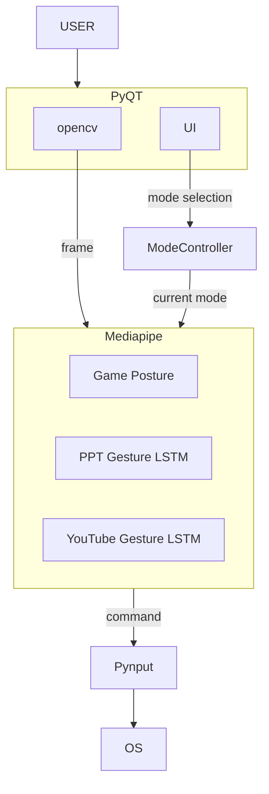

# Gesto System Architecture

시스템 아키텍처: 사용자 입력·캡처·모드·인식·OS 입력의 데이터 흐름과 레이어 역할.

## 데이터 흐름

이미지는 **YOLO 없이** opencv(캡처)에서 받은 프레임을 **바로 Mediapipe**로 전달하여 실시간 인식에 사용한다.

- **USER** → **PyQT**: 사용자 조작(모드 선택, 시작/종료, 감도 등).
- **opencv** → **Mediapipe**: 캡처한 프레임을 별도 처리 없이 Mediapipe로 전달.
- **UI** → **Mode Controller**: 모드 선택(PPT / YouTube / Game).
- **Mode Controller** → **Mediapipe**: 현재 모드에 따른 인식 파이프라인 사용 지시.
- **Mediapipe** → **Pynput**: 인식 결과(명령).
- **Pynput** → **OS**: 키/마우스 입력 시뮬레이션.

## 레이어별 역할

| 레이어 | 역할 |
|--------|------|
| **PyQT (app + capture)** | 사용자 입력 처리, 웹캠(opencv) 캡처. 캡처한 프레임은 별도 처리 없이 Mediapipe로 전달. |
| **Mode Controller** | UI 모드 선택만 입력. 현재 모드 유지, 모드에 따른 인식 파이프라인 선택, 인식 결과 → 명령 → Pynput 전달. |
| **Mediapipe** | Game(Posture) / PPT(Gesture+LSTM) / YouTube(Gesture+LSTM). 현재 모드에 해당하는 경로만 실시간 인식. |
| **Pynput (input_simulator)** | 명령을 OS 입력(키/마우스)으로 실행. |

## 폴더 매핑

| 레이어 | 폴더 |
|--------|------|
| PyQT (UI) | `src/app/` |
| Capture (opencv) | `src/capture/` |
| Mode Controller | `src/mode_controller/` |
| Mediapipe (인식) | `src/mediapipe/` |
| Pynput (OS 입력) | `src/input_simulator/` |
